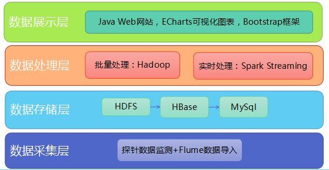

## DataMatrix的架构设计

 

整个系统分为四层：数据采集层、数据存储层、数据处理层、数据展示层：

1. **数据采集层**：探针接收到信号进行内部计算，然后得出结果，并把结果通过url的方式发送到服务器，另外探针的设置可以通过探针内置的web服务器进行设置，这个web服务器是探针的主要设置接口。Flume监听本地文件夹，会自动将数据上传至分布式文件系统HDFS，同时删除本地文件，释放空间。

2. **数据存储层**： 探针原始数据会存入HDFS中，初步处理后将JSON解析存入HBase，最终通过分析算法得出的商业指标会存入MySql便于展示。

3. **数据处理层**：对于HDFS中的数据，分为实时处理线和批处理两条线，若为实时处理，此处直接通过spark streaming进行实时处理，直接把结果存到mysql中，用户可以实时显示当前指标；若为批量处理，在HDFS通过MapReduce把数据都存入hbase中，把hbase中的数据通过数据分析算法把各项商业指标得出存入mysql中。
    
4. **数据展示层**： Java Web建站，将所得指标生动形象的展示出来，借助Echart数据可视化图表、Bootstrap框架，界面大方美观，完美适配移动端。

