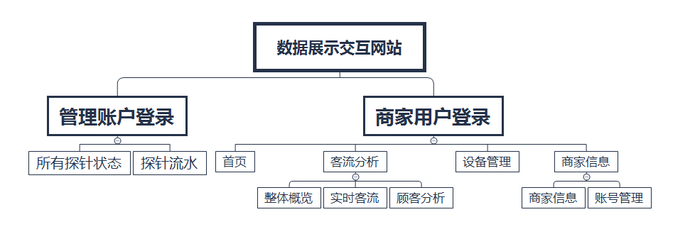

## DataMatrix功能设计

整个DataMatrix数据分析平台，面向管理者和店铺用户，账号分为商家账号和管理者账号。分析平台的普通账号登录是面向商家，商家进入后可以看到绑定探针的数据统计分析管理者登录，会显示所有探针运行状态和流水数据。

### 功能特性

* 首页：  
默认显示首页默认展示昨天的数据分析，包含客流比例、分析、分布、趋势和商家所属探针信息，按天展示，可以自定义选择日期。

* 客流分析部分：  
包含整体概览，实时客流，顾客分析三大部分。整体概览部分，可以看到最近一天、一周、一月的客流量，入店量，跳出量，跳出量、深访量变化；  
实时客流部分，5秒更新一次，可以看到实时的采集数据分析的客流量、入店量变化；  
顾客分析部分显示三个指标，驻店时长、活跃度划分、新老顾客分布。可以按照最近一天，一周，一月的分析，也可以自定义时间段。
* 设备管理部分：  
考虑到一个店铺会拥有多个探针，此部分，可以添加删除，探针，选中设备。选中某个探针，会自动重新加载页面。（目前只能针对单一探针进行分析）。
* 商家设置部分：  
包含商家信息的录入更新与账号信息的添加与更新。

