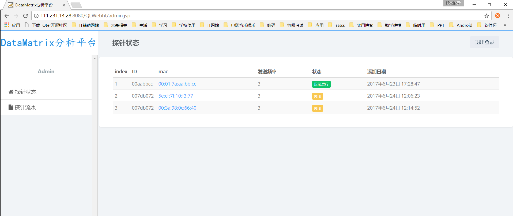
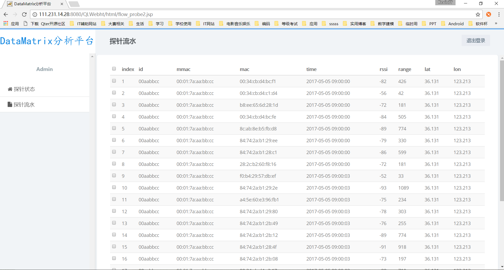
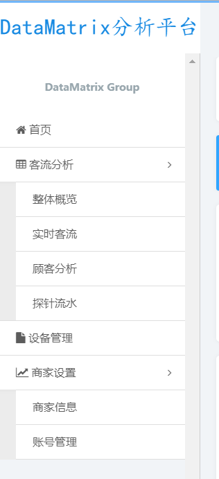
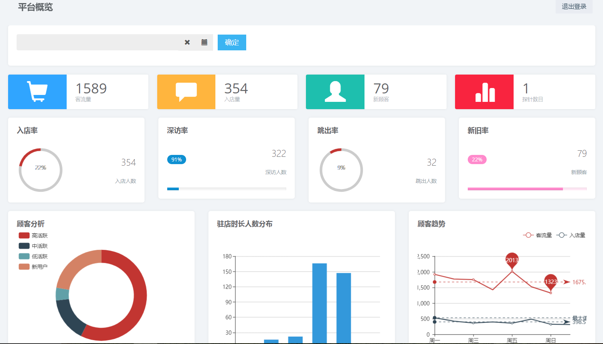
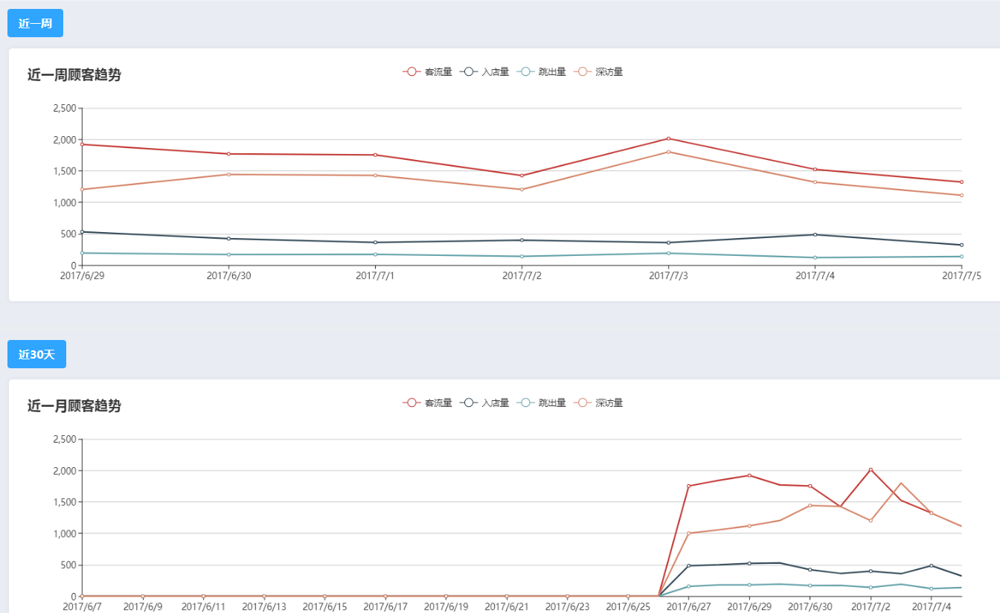
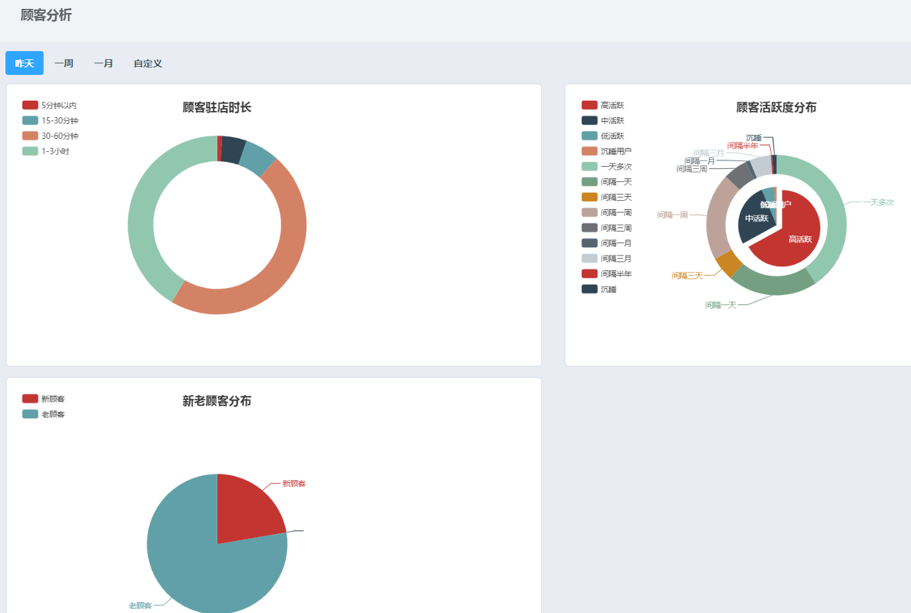
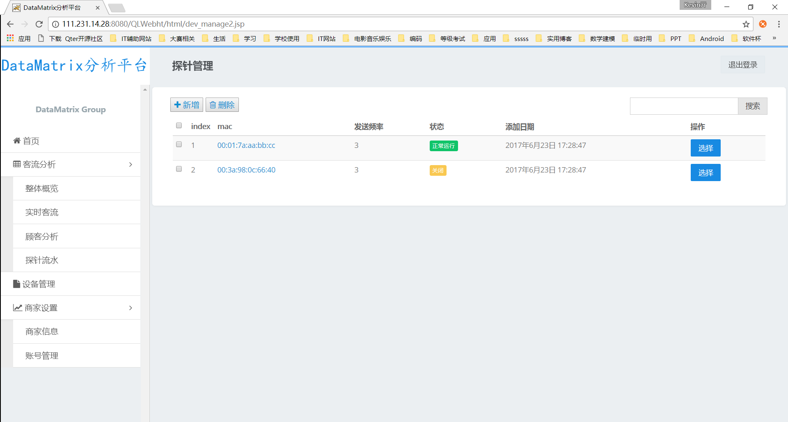

## DataMatrix系统功能展示

**1. 管理员账户登录**  
会将当前探针的运行状态和id、mac等信息读取并显示出来。

**2. 普通账号登录**  
登录后平台分为四大功能部分：首页、客流分析、设备管理、商家设置。相应的包含一些子部分。  

**3. 首页概述**  
按天显示客流比例、分析、分布、趋势和商家所属探针信息。通过对数据库dao层封装，进行分布式数据处理后的大数据的读取与展示。通过时间的限定自定义查询天的数据分析结果。

**4. 客流趋势**  
利用对一段时间的数据查询，进行折线图显示，可以看出变化趋势。

**5. 实时客流**  
利用ECharts的动态图组件，配合spark streaming实时得出的客流量等数据进行实时展示。
`(待完善)`

**6. 顾客分析**  
这部分显示三个指标，驻店时长、活跃度划分、老老顾客分布。可以按照最近一天，一周，一月的分析，也可以自定义时间段。从数据库中读取数据，统一采用饼状图直观展示，方便查看比例信息。

**7. 探针管理**  
维护一个探针表，会标明探针所属店铺。从而实现店铺探针的绑定。方便之后功能的扩展。考虑到一个店铺会拥有多个探针，此部分，可以添加删除，探针，选中设备。

**8. 商家信息**  
这部分用一个商家数据表记录，需要手动输入与更新，主要是为了后续对具体店家做一些数据挖掘与个性化推荐的工作而维护。
